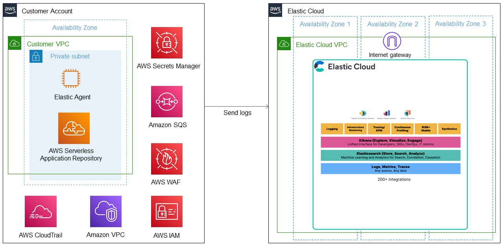
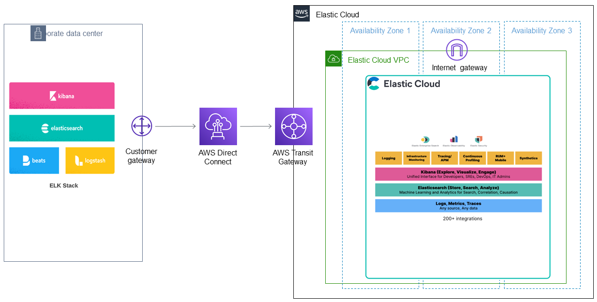

## Terraform for Elastic Cloud on AWS
This Terraform module automates your Elastic Cloud deployment and optional data migration to the AWS Cloud. The deployment provisions the following components:

* Your Elastic Cloud cluster.
* Amazon Elastic Compute Cloud (Amazon EC2), which is needed for [Elastic Agent](https://www.elastic.co/elastic-agent).
* An Amazon Simple Storage Service (Amazon S3) bucket needed for [Elasticsearch snapshots](https://www.elastic.co/guide/en/elasticsearch/reference/current/snapshot-restore.html).
* [Elastic Serverless Forwarder](https://www.elastic.co/blog/elastic-and-aws-serverless-application-repository-speed-time-to-actionable-insights-with-frictionless-log-ingestion-from-amazon-s3) for data ingestion.
* An AWS Identity and Access Management (IAM) instance role with fine-grained permissions to access AWS services.

Existing customers with Elasticsearch cluster data stored on premises in a self-managed Elasticsearch cluster can optionally choose to migrate that data into Elastic Cloud after deployment to AWS. Both the deployment and migration processes are covered in this document. 

> **Note**: If using [HashiCorp Vault](https://www.vaultproject.io/), see the examples and accompanying readme in the [examples/vault](https://github.com/aws-ia/terraform-elastic-cloud/tree/develop/examples/vault) folder in this GitHub repository.

### Authors and Contributors

Battulga Purevragchaa (AWS), Uday Theepireddy (Elastic) and [other contributors](https://github.com/aws-ia/terraform-elastic-cloud/graphs/contributors).  

## Deployment (without data migration)

### Prerequisites
Check that you are running the most current version of Terraform software. For more, see [Install Terraform](https://learn.hashicorp.com/tutorials/terraform/install-cli).

### Deployment architecture


The deployment sets up the following components.
- A highly available architecture that spans multiple Availability Zones.
- A virtual private cloud (VPC) configured with public and private subnets according to AWS best practices, to provide you with your own virtual network on AWS.
- An AWS EC2 instance for the Elastic Agent.
- AWS Serverless Application Repository functions integration to create an Elastic forwarder and multiple sources to ingest into Elastic Cloud. 
- Elastic Agent and Elastic serverless forwarder to receive logs from the S3 bucket.
- AWS Secrets Manager to store Elasticsearch credentials
- Amazon SQS to ingest logs contained in the S3 bucket through event notifications.
- AWS WAF to protect web applications from common web exploits.
- AWS CloudTrail to track user activity and API usage.
- Amazon VPC flow logs to capture information about IP traffic going to and from network interfaces.
- Amazon S3 buckets to host Elastic snapshots and capture logs from the various AWS services such as AWS WAF, Amazon VPC flow logs, AWS CloudTrail, and network firewall logs.
- An AWS IAM role with fine-grained permissions for access to AWS services required for deployment.

### Deployment steps 
1.	Generate an Elasticsearch Service (ESS) API key:

	1.	Open your browser and navigate to https://cloud.elastic.co/login.
	2.	Log in with your email address and password.
	3.	Choose **Elasticsearch Service**.
	4.	Navigate to **Features > API Keys** and choose **Generate API Key**.
	5.	Choose a name for your API key.
	6.	Save your API key in a safe location.

2.	Clone the [Terraform Elastic Cloud Git repository](https://github.com/aws-ia/terraform-elastic-cloud) using the following commands:

```
git clone https://github.com/aws-ia/terraform-elastic-cloud  
cd terraform-elastic-cloud
```

3.	Create <your file name>.tfvars file in the same directory with the following variable definitions:
  ```
name = "Elasticsearch Cluster"
apikey = "<your Elastic API key>"
  ```
	
4.	Run the Terraform module <your file name>.tfvars file, as shown here:
 ```
terraform init
terraform apply -var-file="<your file name>.tfvars"
 ```
## Deployment with Elasticsearch data migration

When planning your Elasticsearch data migration to Elastic Cloud, you have a few options. In some cases, you may not need to migrate the data in existing clusters. This is common when you are planning to migrate the data source itself and can just re-ingest the data into Elastic Cloud after migration. Another reason for not migrating your data is when the existing indices are time-sensitive and no longer needed. In these cases, you can just deploy Elastic Cloud without migrating any data from existing clusters.

For cases where the data must be migrated to Elastic Cloud, options depend on the use case, data volume, current Elasticsearch version, and uptime requirements on the current Elasticsearch application. Options include: 
- **Snapshot and restore** – In this option, you create an S3 bucket, add a snapshot of the current deployment into the bucket, add the same repository from Elastic Cloud, and finally restore indexes from the snapshot into Elastic Cloud. This option is covered in the steps that follow. 
- **Re-index from a remote cluster** – In this option, you use the re-index API from the new cluster to retrieve data from the indices in the existing Elasticsearch cluster and then re-index them in the new Elastic Cloud deployment. This option is not covered in this document. 

> **Note**: To learn more, visit [AWS Prescriptive Guidance: Migrate an ELK Stack to Elastic Cloud on AWS](https://docs.aws.amazon.com/prescriptive-guidance/latest/patterns/migrate-an-elk-stack-to-elastic-cloud-on-aws.html).
	
### Prerequisites

- Verify that the target Elastic Cloud is running a version that is the same or higher than the current Elasticsearch cluster. For more information about version compatibility, refer to the [Elastic Cloud documentation](https://www.elastic.co/guide/en/elasticsearch/reference/8.0/snapshot-restore.html#snapshot-restore-version-compatibility).
- Check for limitations and version-specific breaking changes to confirm that no constraints exist that might affect migration to Elastic Cloud. For more information, refer to the [Snapshot and restore](https://www.elastic.co/guide/en/elasticsearch/reference/current/snapshot-restore.html) and [Upgrade Elasticsearch](https://www.elastic.co/guide/en/elasticsearch/reference/current/setup-upgrade.html) topics in the Elasticsearch Guide. 
- If you don’t already have AWS Command Line Interface (AWS CLI) and the Amazon S3 plug-in on your existing Elasticsearch cluster, install it from the Elasticsearch home directory with the following command: 
	
 ```
sudo bin/elasticsearch-plugin install repository-s3
 ```
- Add the Amazon S3 access keys to the Elasticsearch keystore by running the following commands from the root directory of the existing Elasticsearch cluster. When prompted, enter the appropriate keys to access and store a snapshot in an S3 bucket from your self-managed Elasticsearch. 
	
 ```
bin/elasticsearch-keystore add s3.client.default.access_key
bin/elasticsearch-keystore add s3.client.default.secret_key 
 ```
### Migration architecture

	
The migration takes the following high-level steps: 
1.	Creates and registers an Elastic Cloud snapshot repository using Amazon S3.
2.	Creates and configures a local snapshot repository and points to the S3 bucket.
3.	Creates a new snapshot from the local cluster and stores it in the S3 bucket.
4.	Closes all indices in Elasticsearch Cloud.
5.	Restores the local cluster data from the snapshot in Elasticsearch Cloud.
6.	Opens all indices in Elasticsearch Cloud.

### Deployment steps with data migration
	
Existing customers who are already running Elasticsearch cluster on premises can use a built-in feature of Elastic Cloud to migrate to the AWS Cloud. Be sure to replace the example values in brackets (<>) with your own values.

To perform the deployment with migration:
1.	Generate an Elasticsearch Service (ESS) API key:

	1.	Open your browser and navigate to https://cloud.elastic.co/login.
	2.	Log in with your email address and password.
	3.	Choose Elasticsearch Service.
	4.	Navigate to **Features > API Keys** and choose **Generate API Key**.
	5.	Choose a name for your API Key.
	6.	Save your API key in a safe location.

2.	Clone the [Terraform Elastic Cloud Git repository](https://github.com/aws-ia/terraform-elastic-cloud) using the following commands:

```
git clone https://github.com/aws-ia/terraform-elastic-cloud  
cd terraform-elastic-cloud 
```

3.	Create <your file name>.tfvars file in the same directory with the following variable definitions:
	
```
name = "Elasticsearch Cluster"
apikey = "Your Elastic API Key"
s3_client_access_key = "your AWS access key"
s3_client_secret_key  = "your AWS secret key"
local_elasticsearch_url = "your local Elastic cluster URL"
```

> Note: Assign the URL of your self-managed Elasticsearch to `local_elasticsearch_url` (for example, http://127.0.0.1:9200).

4.	Run the Terraform module to deploy the Elastic Cloud cluster on AWS and migrate the self-managed Elasticsearch data.

```
terraform init
terraform apply -var-file="<your file name>.tfvars"
```
## Clean up the infrastructure
If you no longer need the infrastructure that’s provisioned by the Terraform module, run the following command to remove the deployment infrastructure and terminate all resources. 
	
```
terraform destroy -var-file="<your file name>.tfvars"
```

## Elastic Cloud automation structure
The following Terraform modules are used for Elastic Cloud deployment.

| Name | Description |
|------|------|
| [examples/vault](https://github.com/aws-ia/terraform-elastic-cloud/tree/develop/examples/vault) | Example modules if you are using [HashiCorp Vault](https://www.vaultproject.io/) |
| [ec_aws_resource.tf](https://github.com/aws-ia/terraform-elastic-cloud/blob/develop/ec_aws_resources.tf) | Creates all the AWS resources needed for the deployment | 
| [ec_migrate.tf](https://github.com/aws-ia/terraform-elastic-cloud/blob/develop/ec_migrate.tf) | Migrates self-managed Elasticsearch data to Elastic Cloud |  
| [ec_secrets.tf](https://github.com/aws-ia/terraform-elastic-cloud/blob/develop/ec_secrets.tf) | Contains code to retrieve the secrets keys |
| [main.tf](https://github.com/aws-ia/terraform-elastic-cloud/blob/develop/main.tf) | Contains the primary entry point for Elastic Cloud deployment | <your file name>.tfvars | Provides required input values. |
| [outputs.tf](https://github.com/aws-ia/terraform-elastic-cloud/blob/develop/outputs.tf) | Used for the declarations of [output values](https://www.terraform.io/language/values/outputs) | <your file name>.tfvars | Provides required input values. |
| [providers.tf](https://github.com/aws-ia/terraform-elastic-cloud/blob/develop/providers.tf) | Specifies [providers](https://www.terraform.io/language/providers) | <your file name>.tfvars | Provides required input values. |
| [variables.tf](https://github.com/aws-ia/terraform-elastic-cloud/blob/develop/variables.tf) | Contains the declaration of [input variables](https://www.terraform.io/language/values/variables) | <your file name>.tfvars | Provides required input values. |
| \<your file name>.tfvars | Provides required input values |