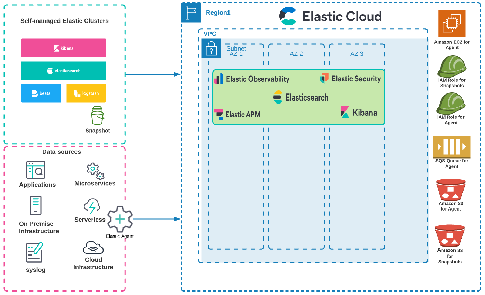

## Terraform for Elastic Cloud on AWS
This Terraform module automates your Elastic Cloud deployment and optional data migration to the AWS Cloud. The deployment provisions the following components:

●	Your Elastic Cloud cluster.
●	Amazon Elastic Compute Cloud (Amazon EC2), which is needed for [Elastic Agent](https://www.elastic.co/elastic-agent).
●	An Amazon Simple Storage Service (Amazon S3) bucket needed for [Elasticsearch snapshots](https://www.elastic.co/guide/en/elasticsearch/reference/current/snapshot-restore.html).
●	[Elastic Serverless Forwarder](https://serverlessrepo.aws.amazon.com/applications/eu-central-1/267093732750/elastic-serverless-forwarder) for data ingestion.
●	An AWS Identity and Access Management (IAM) instance role with fine-grained permissions to access AWS services.

Existing customers with Elasticsearch cluster data stored on premises in a self-managed Elasticsearch cluster can optionally choose to migrate that data into Elastic Cloud after deployment to AWS. 

Both the deployment and migration processes are covered in this document. 

## Prerequisites
Check that you are running the most current version of Terraform software. For more information, refer to [Install Terraform](https://learn.hashicorp.com/tutorials/terraform/install-cli).

## Deployment architecture


## Supported Features
- Provisioning [Elastic Cloud](https://www.elastic.co/cloud/) cluster on AWS
- Provisioning AWS resources needed for [Elastic Agent](https://www.elastic.co/elastic-agent)
- Migrating Elasticsearch cluster data from self-managed Elasticsearch to Elastic Cloud

## Prerequisites
- [Terraform](https://www.terraform.io/downloads.html) 0.13+
- Elasticsearch API key (`var.apikey`)
- AWS access key (`var.s3_client_access_key, var.s3_client_secret_key`)

## Architectural Diagram


## Deployment Steps
1. Install Terraform. For instructions and a video tutorial, see [Install Terraform](https://learn.hashicorp.com/tutorials/terraform/install-cli). 
2. Clone this **aws-ia/terraform-elastic-cloud** repository using the following command:
   `git clone https://github.com/aws-ia/terraform-elastic-cloud`
3. Change directory to the root repository directory: 
   `cd terraform-elastic-cloud/`
4. Generate an Elasticsearch Service (ESS) API Key:
   1. Open your browser and navigate to <https://cloud.elastic.co/login>.
   2. Log in with your email and password.
   3. Click on [Elasticsearch Service](https://cloud.elastic.co/deployments).
   4. Navigate to [Features > API Keys](https://cloud.elastic.co/deployment-features/keys) and click on **Generate API Key**.
   5. Choose a name for your API key.
   6. Save your API key somewhere safe
5. Create an AWS access key
   1. Create an S3 bucket policy allows List, Read, Write permissions
   2. Create an IAM user and attach the policy created above
   3. Ensure to check `Programmatic access` for the IAM user
   4. Save your AWS access key somewhere safe
6. Run Terraform by using the following commands and provide the keys:
    ```
   terraform init
   terraform apply
    ```
   
## Migration Steps
If `var.local_elasticsearch_url` is provided with a value (e.g., http://127.0.0.1:9200), the quick start will migrate the self-managed Elasticsearch cluster data with the following high-level steps:
- Creates and registers an Elastic Cloud snapshot repository by using Amazon S3 service
- Creates and configures a local snapshot repository and point to the Amazon S3 bucket
- Creates a new snapshot from the local cluster and store it in the Amazon S3 bucket
- Closes all indices in Elasticsearch Cloud
- Restores the local cluster data from the snapshot in Elasticsearch Cloud
- Open all indices in Elasticsearch Cloud

## Authors and Contributors
   
Battulga Purevragchaa (batpur@amazon.com), Uday Theepireddy (udayasimha.theepireddy@elastic.co) and [other contributors](https://github.com/aws-ia/terraform-elastic-cloud/graphs/contributors).
